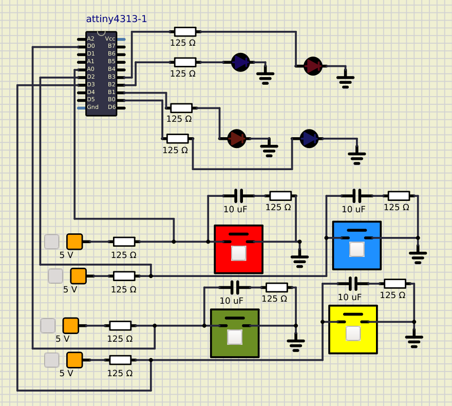

# Laboratorio 2. GPIOs, Timers y FSM

Este proyecto corresponde al segundo laboratorio del curso Lanoratorio de Microcontroladores de la Universidad de Costa Rica. Realizado por Sofia Fonseca Munoz.

El laboratorio consiste en el uso del microcontrolador ATtiny4313 y componentes que complementen su uso para la creacion del juego Simon dice. En el juego hay 4 leds y cuatro botones de colores correspondientes entre rojo, azul, verde y amarillo. 
Para ganar el juego, se debe adivinar la secuencia aleatoria correctamente. Existen 14 secuencias y el tiempo en que se muestra cada una de ellas disminuye en cada nivel. 

Este proyecto fue simulida por medio de Simulide y su funcionamiento se puede en la carpeta src.

[//]: <> ()
