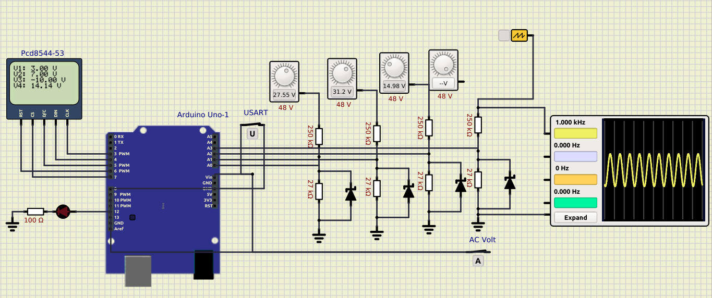

# Laboratorio 3. Arduino: GPIO, ADC y comunicaciones

Este proyecto corresponde al tercer laboratorio del curso Laboratorio de Microcontroladores de la Universidad de Costa Rica. Realizado por Sofia Fonseca Munoz.

El laboratorio consiste en el uso del microcontrolador Arduino UNO y componentes que complementen su uso para la creacion de un voltimetro AC y DC. Este voltimetro es capaz de medir voltajes entre -24 V y 24 V. En la pantalla muestra el valor, el cual es RMS en caso de ser AC. Los primeros 3 medidores son DC y el ultimo tiene la capacidad de convertirse utilizando el switch. 
Ademas tiene la capacidad de enviar los datos a la computadora y generar un archivo .csv cuando el switch correspondiente se activa. 

Este proyecto fue simulida por medio de Simulide y su funcionamiento se puede en la carpeta src.

[//]: <> ()
