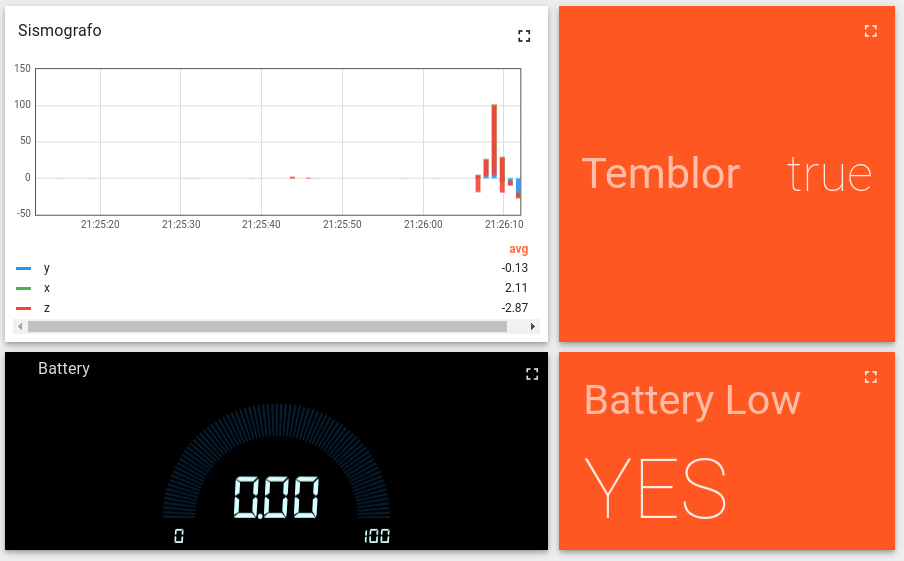
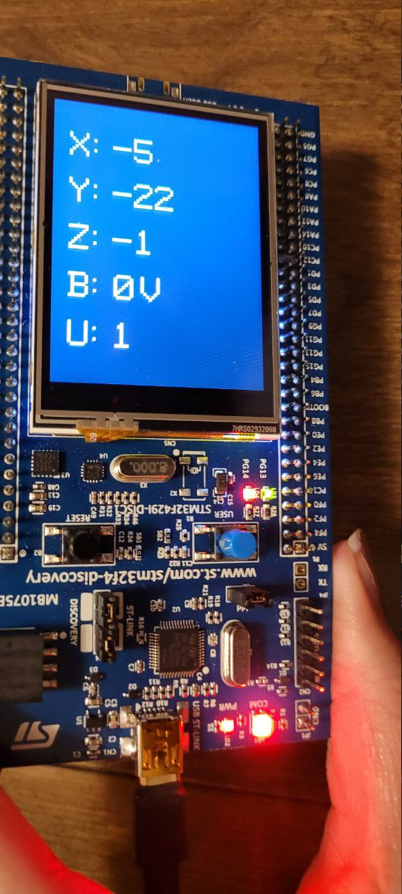

# Laboratorio 4. STM32: GPIO, ADC, comunicaciones, Iot

Este proyecto corresponde al cuarto laboratorio del curso Laboratorio de Microcontroladores de la Universidad de Costa Rica. Realizado por Sofia Fonseca Munoz.

To do: Agregar descripcion
Agregar dependencias
Agregar como correrlo

[//]: <> ()
[//]: <> ()
